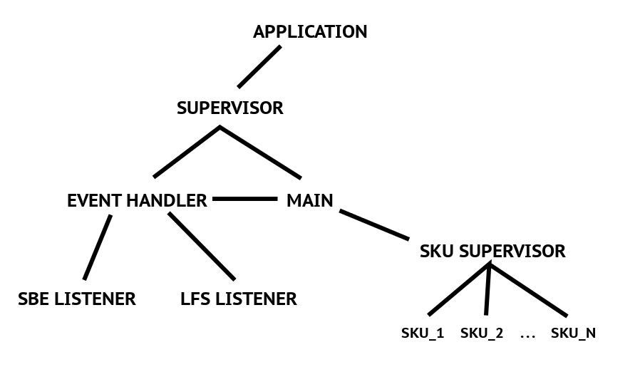

Demo
====
    iex -S mix
    GenServer.cast(Main, {:qty_at_location, "Sku1", 8, "Location1"})

### Terms ###

| Term        | Meaning                                         | Kind of Like |
|-------------|-------------------------------------------------|--------------|
| BEAM        | Erlang / Elixir virtual machine                 | JVM          |
| OTP         | Standard libraries and practices                | J2EE         |
| Concurrency | Processes operating independently of each other | isolation    |

### What is Elixir ###

New language, but compiles to Erlang BEAM code and uses OTP / Erlang libraries heavily. 

#### Why is Erlang great? ####

- No mutable state
- Concurrancy built into the language
- Pattern matching
- Hot code loading
- Error recovery
- Doesn't pretend to break the laws of physics

Combine to create environments that are highly scalabe and easy to reason about

#### Why is Elixir great? ####

- Sane unicode support
- Macros
- Cool stdlib (Stream, Enum, etc)
- Pipe command & other sugar

I never cared much about syntax but the fact it looks of ruby seems to make some people happy.

## Example App ##

Very simplistic version of SBEFeed problem

See if you can spot the bugs ;)

